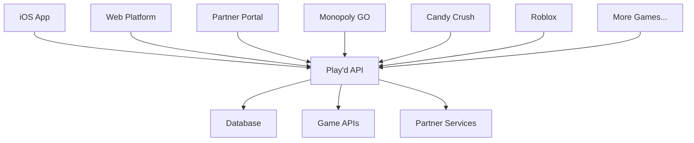

# 🪆 Play'd - The Revolutionary Gaming Rewards Platform

> **Team Jardine³** | Vibe Coding Competition 2025 | *"Democratizing development so anyone, anywhere can build something life-changing"*

---

## 🚀 **Revolutionary Concept**

Play'd transforms mobile gaming engagement by creating a **universal rewards ecosystem** that bridges players, games, and partners. Instead of isolated in-game currencies, players earn **Darumas** (🪆) that work across multiple games and real-world rewards.

### **The Problem We Solve**
- **Fragmented Rewards**: Players' investments trapped in individual games
- **Low Engagement**: No cross-game progression or universal benefits
- **Missed Opportunities**: Games can't leverage external partnerships for retention

### **Our Solution: The Play'd Ecosystem**
1. **Universal Currency**: Darumas work across all partner games
2. **Cross-Game Progression**: Achievements in one game unlock rewards in others
3. **Real-World Integration**: Redeem gaming success for actual products/services

---

## 📱 **Platform Components**

### **1. iOS Mobile App**
*The player's command center for their gaming universe*

**Key Features:**
- 🪆 **Daruma Balance**: Universal currency across all games
- 🎮 **Game Marketplace**: Discover and redeem rewards in partner games
- 🔗 **Deep Linking**: Seamless transitions between games
- ⚙️ **Account Management**: Settings, balance, and redemption history

**Technical Highlights:**
- Native SwiftUI architecture for optimal performance
- Real-time balance updates with smooth animations
- Universal deep linking system supporting multiple games
- Professional iOS design patterns and accessibility

[**📲 Download on TestFlight**](https://testflight.apple.com/join/vH9Bxxrg)

### **2. Web Platform**
*Comprehensive dashboard and game discovery portal*

**Key Features:**
- 📊 **Analytics Dashboard**: Track earnings, spending, and gaming patterns
- 🎯 **Challenge System**: Daily/weekly tasks across games
- 🏆 **Leaderboards**: Compete with friends and global players
- 🛍️ **Rewards Catalog**: Browse and redeem from partner network

**Live Demo:** [finalplayd.vercel.app](https://finalplayd.vercel.app/)

### **3. B2B Partner Portal**
*Self-service onboarding for games and reward partners*

**Key Features:**
- 🤝 **Partner Onboarding**: Streamlined integration for new games
- 📈 **Performance Analytics**: Track player engagement and conversions
- 💰 **Revenue Sharing**: Transparent reporting and payouts
- 🔧 **API Management**: Developer tools and documentation

**Partner Access:** [playd-partner-portal.vercel.app](https://playd-partner-portal.vercel.app)

---

## 🏗️ **Architecture Overview**

### **Technology Stack**

| Component | Technology | Purpose |
|-----------|------------|---------|
| **Mobile App** | SwiftUI, iOS 17+ | Native performance & deep linking |
| **Web Platform** | Next.js, React, TypeScript | Responsive dashboard & analytics |
| **Partner Portal** | Next.js, React, Tailwind | B2B self-service platform |
| **Backend API** | Node.js, Express | Unified data layer |
| **Database** | PostgreSQL | Secure user & transaction data |
| **Deployment** | Vercel, TestFlight | Scalable hosting & distribution |

---

## 🎮 **Supported Games**

### **Launch Partners**
- 🏠 **Monopoly GO** - Board game nostalgia meets mobile innovation
- 🍭 **Candy Crush Saga** - Match-3 puzzle gaming phenomenon
- 🎮 **Roblox** - User-generated gaming metaverse
- 🛡️ **Clash of Clans** - Strategic base-building empire
- ⚽ **Madden NFL Mobile** - Professional football simulation
- 👑 **Royal Match** - Medieval puzzle adventure

### **Integration Benefits for Games**
- **Increased Retention**: Cross-game rewards keep players engaged longer
- **New Revenue Streams**: Commission on Daruma transactions
- **Enhanced Discovery**: Featured placement drives new user acquisition
- **Community Building**: Shared achievement system across titles

---

## 🏆 **Competitive Advantages**

### **1. Universal Rewards Ecosystem**
Unlike isolated game currencies, Darumas create value that transcends individual titles, increasing player lifetime value across the entire network.

### **2. Seamless Integration**
Our deep linking system and SDK make integration effortless for game developers, requiring minimal code changes for maximum benefit.

### **3. Real-World Value**
Players can redeem gaming achievements for tangible rewards, creating unprecedented connection between virtual progress and real benefits.

### **4. Network Effects**
Each new game or partner increases value for all existing participants, creating a self-reinforcing growth flywheel.

---

## 📊 **Market Opportunity**

- **Mobile Gaming Market**: $138B globally (2023)
- **Loyalty Programs**: $5.57B market growing 12% annually
- **Cross-Game Integration**: Currently underserved segment
- **Target Demographic**: 2.8B mobile gamers worldwide

### **Revenue Model**
1. **Transaction Fees**: Commission on Daruma purchases/redemptions
2. **Partner Subscriptions**: Monthly fees for advanced analytics/features
3. **Premium Services**: Enhanced rewards and exclusive partnerships
4. **API Licensing**: White-label solutions for enterprise clients

---

## 🚀 **Quick Start**

### **For Players**
1. Download the iOS app from TestFlight
2. Complete onboarding and receive starter Darumas
3. Connect your favorite games
4. Start earning rewards across your gaming portfolio

### **For Game Developers**
1. Visit the Partner Portal to register your game
2. Integrate our SDK (5-minute setup)
3. Configure reward structures and conversion rates
4. Launch and start earning from cross-game engagement

### **For Reward Partners**
1. Apply through the Partner Portal
2. Set up your reward catalog and redemption process
3. Configure API endpoints for fulfillment
4. Go live and reach millions of engaged gamers

---

## 🤝 **Team Jardine³**

**Our Mission**: *Democratizing development so anyone, anywhere can build something life-changing*

- **Thomas Jardine**: Product Strategy & Frontend Development
- **Hayden Jardine**: Full-Stack Engineering & AI Integration
- **Tom Jardine**: Data Engineering & Quality Assurance

### **Competition Strategy: "The Lincoln Approach"**
*"Give me six hours to chop down a tree, and I will spend the first four sharpening the axe."*

**Hours 0-4**: Deep research and user journey mapping
**Hours 4-14**: AI-accelerated development with Cursor
**Hours 14-18**: Testing, demo preparation, and presentation polish

---

## 📋 **Development Roadmap**

### **Phase 1: Foundation** ✅
- [x] iOS app with universal currency system
- [x] Web platform with analytics dashboard
- [x] Partner portal for B2B onboarding
- [x] Deep linking integration for major games

### **Phase 2: Expansion** 🚧
- [ ] Android app development
- [ ] Advanced analytics and ML recommendations
- [ ] Real-world partner integrations (restaurants, retail)
- [ ] Social features and friend competitions

### **Phase 3: Ecosystem** 🔮
- [ ] Game developer SDK for custom integrations
- [ ] White-label solutions for publishers
- [ ] Blockchain integration for true asset ownership
- [ ] International expansion and localization

---

## 📞 **Contact & Demo**

- **Live Demo**: [Schedule a demo](mailto:team@jardine-cubed.com)
- **Partner Inquiries**: [partners@jardine-cubed.com](mailto:partners@jardine-cubed.com)
- **Developer Support**: [dev@jardine-cubed.com](mailto:dev@jardine-cubed.com)

---

## 🏅 **Recognition**

Built for **Vibe Coding Competition 2025** - Indianapolis
*Showcasing the future of cross-platform gaming rewards*

---

**🪆 Play'd - Where Gaming Achievements Become Real Rewards 🪆**

*Made with ❤️ by Team Jardine³*

